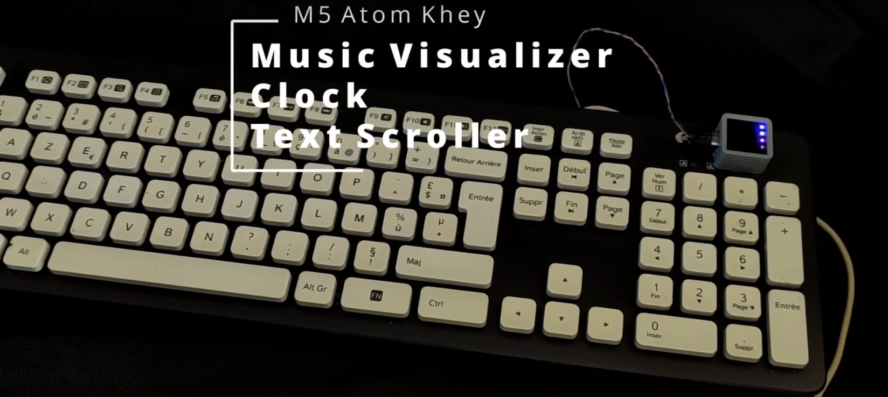
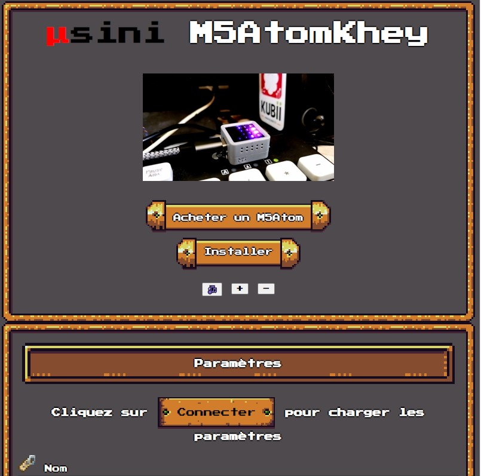
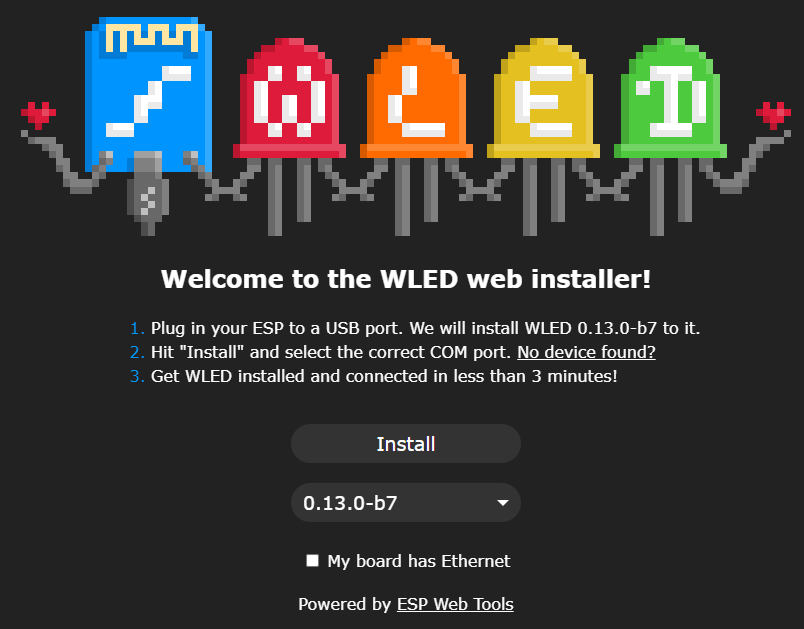
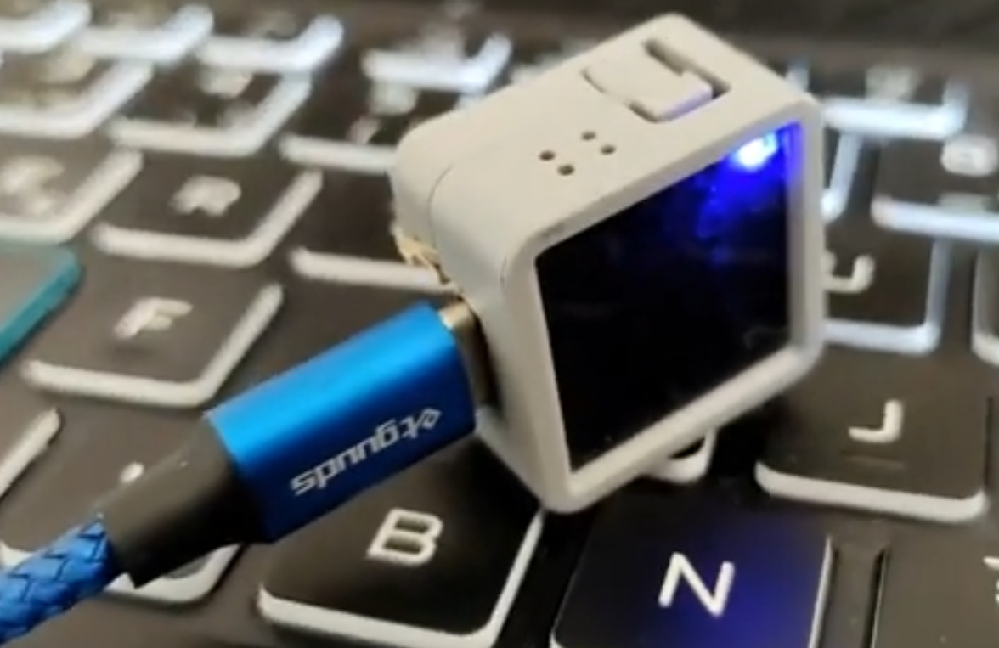
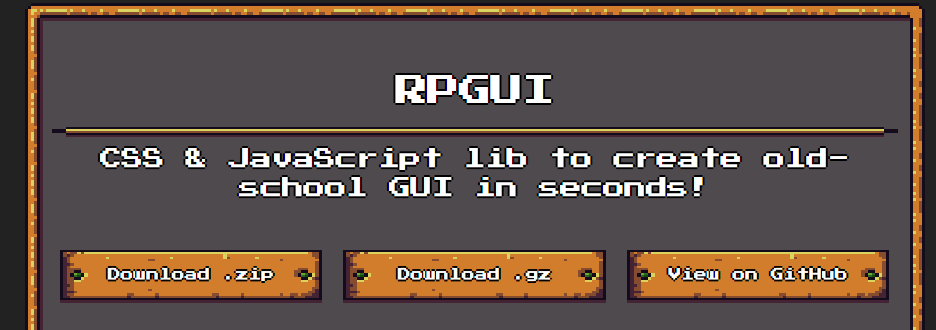
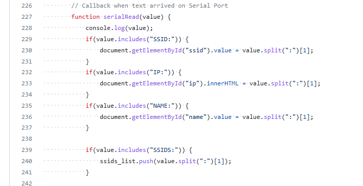

#  [🇬🇧 English](README.md)

# Présentation

Si vous avez un M5Atom Matrix, voici un projet à tester en juste quelques clics.    
L'installation se fait directement depuis une page web 
## 💾 [Installer Maintenant](https://usini.github.io/M5atomKhey/)

M5Atom Khey permet
* ⏲ d'afficher l'heure
* 📟 d'afficher du texte
* 🎶 de réagir à de la musique

J'utilise (comme beaucoup) pas mal WLED qui permet de contrôler des strips de LED, mais WLED ne permet pas d'utiliser une matrix pour à la fois la contrôler à distance (à l'aide de E131) et pour afficher du texte ou l'heure.   
J'ai donc crée cette version (qui pour le moment ne fonctionne qu'avec le M5Atom Matrix)   

Le nom est un jeu de mots entre Key (Touche) et le mot Khey ("mon frère" en arabe maghrébin) parce que le but est d'ajouter une touche sur son clavier et que le M5Atom soit le frère du clavier.

# Genèse du Projet
M5Athom Khey est plus une expérimentation qu'un projet en soi.    



Ce projet est une démonstration d'une méthodologie pour rendre la programmation d'une carte électronique le plus accessible possible.    
Plus exactement aussi simple que l'installation d'une application sur téléphone portable depuis un store.    

Bien que l'électronique est devenue de plus en plus simple à apprendre grâce à Arduino et Espressif, elle reste réservée à ceux qui ont du temps à consacrer à la programmation.   
J'ai constaté qu'il restait une forte barrière à l'entrée dans ce domaine, ce qui limite le nombre de personnes qui vont s'intéresser à l'électronique open source.    

Mais cela a changé avec l'apparition d'un outil révolutionnaire : [ESP Web Tools](https://esphome.github.io/esp-web-tools/)    



ESP Web Tools permets de programmer n'importe quelle puce de chez Espressif (les plus utilisés dans le milieu des makers) en un clic (Plus exactement 3).   

Ce programme peut être ajouté à une page web en quelques lignes, ce qui fait qu'il est utilisable depuis n'importe quel ordinateur sans n'avoir rien à installer.    

``` html
<script
  type="module"
  src="https://unpkg.com/esp-web-tools@7.1.0/dist/web/install-button.js?module"
></script>
<esp-web-install-button
  manifest="/static/firmware_build/manifest.json"
></esp-web-install-button>
```

ESP Web Tools utilise le [WebSerial](https://web.dev/serial/) qui permet de communiquer avec des puces électroniques connectées en USB depuis un navigateur web



Grâce à WebSerial, on peut installer et configurer des puces électroniques depuis l'USB aussi facilement que l'on paramétrerait son compte sur Facebook ou Gmail...

Malheuresement Firefox ne gère pas le WebSerial donc il vous faudrait utiliser un autre navigateur pour tester ça.    

# L'interface de l'installeur
Pour rendre l'installeur le plus abordable possible, j'ai adopté l'esthétique d'un jeu vidéo, afin de créer un sentiment de nostalgie et de confort.    

Pour cela, j'ai utilisé [RPGUI](http://ronenness.github.io/RPGUI/)


Dans le monde du web, tout est tellement aseptisé et formaté, je me suis dit que cela ferait aussi une bouffée d'air frais.    
Je trouve intéressant de réfléchir à comment créer un installeur qui surprend, et soit une expérience en soi plutôt qu'un passage nécessaire.    

L'interface est entièrement traduisible (et disponible en anglais et en français) - [Traduction](https://github.com/usini/M5atomKhey/tree/main/docs/i18n)

Bien qu'ESP Web Tools fournissent une méthode pour paramétrer le WiFi, elle est très peu documenté et à l'air assez complexe.   
J'ai donc crée mon propre système, plus basique, mais plus facilement malléable, elle peut être très facilement adaptée pour fonctionner avec des programmes déjà existants sans
avoir à vraiment le modifier.    

Vous pouvez y jeter un coup d'oeil ici : https://github.com/usini/M5atomKhey/blob/main/docs/index.html#L154



# Ma méthode pour générer le firmware
Platformio génère le firmware dans **.pio/build/m5stack-atom**   
Je récupère tout simplement **firmware.bin** et **partitions.bin** dans ce dossier.   

Il vous faudra aussi **boot_app0.bin** et **bootloader.bin**, j'ai récupéré celui sur un autre installeur web.    

Cette méthode n'est pas recommandée, mais fonctionne.   
Si vous voulez récupérer ces deux fichiers correctement, jeter un oeil à la documentation de Brian Lough : https://github.com/witnessmenow/ESP-Web-Tools-Tutorial    

Dans platformio allez dans **Project Tasks --> Advanced --> Verbose Upload**   
Pour afficher, quel bootloader est utilisé

Les bootloaders se trouvent ici dans Windows : 
```
%HOMEPATH%\.platformio\packages\framework-arduinoespressif32\tools\sdk\bin\
```

Boot_app0 se trouve ici dans Windows : 
```
%HOMEPATH%\.platformio\packages\framework-arduinoespressif32\tools\partitions\
```


