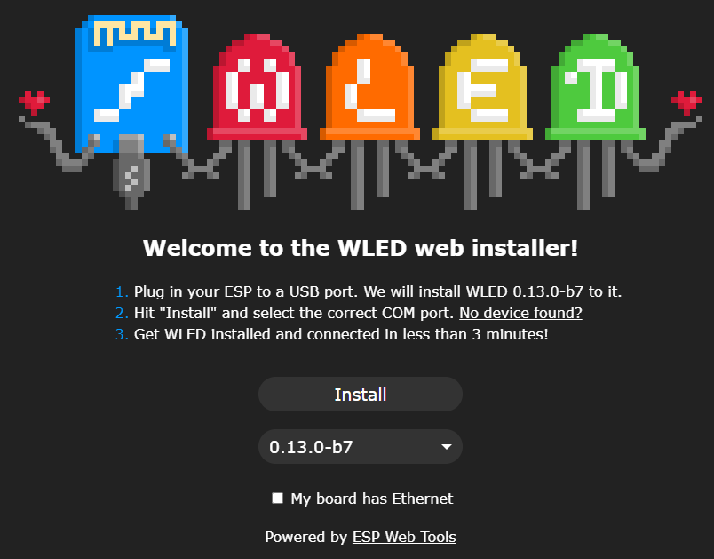
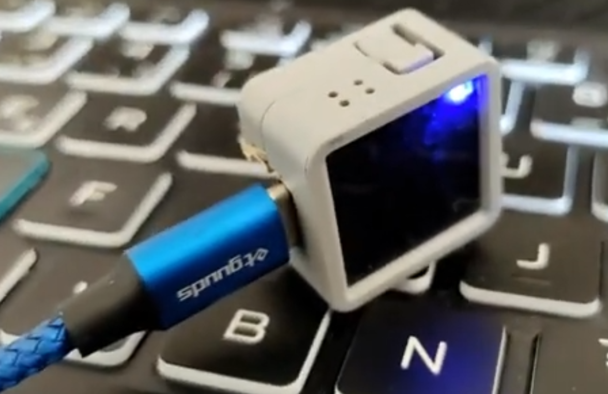
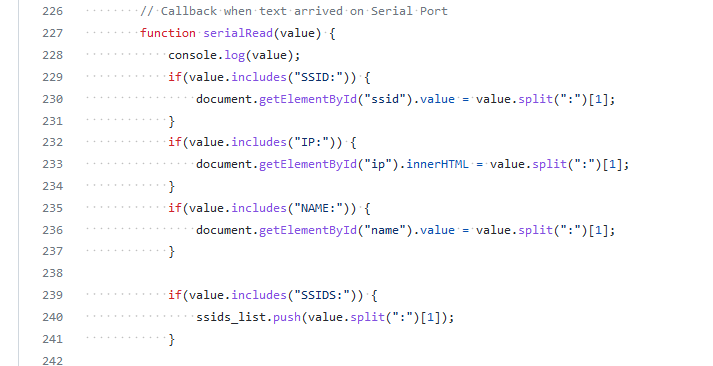

#  [🇫🇷 Français](README.fr.md)


If you have a M5Atom Matrix, here is a project to test in just a few clicks.   
Installation is done directly from a web page
## 💾 [Install Now](https://usini.github.io/M5atomKhey/)

M5Atom Khey allows you to
* ⏲ display the time
* 📟 display text
* 🎶 react to music

I use (like many) a lot WLED to control LED strips, but WLED does not allow to use a matrix to both control it remotely (using E131) and to display text or time.
So I created this project (which for the moment only works with the M5Atom Matrix)

The name is a pun between Key (Key) and the word Khey ("my brother" in Maghrebi Arabic) because the goal is to add a key on its keyboard and that the M5Atom is the "brother" of the keyboard.

# Genesis of the Project
M5Athom Khey is more an experiment than a project in itself.


This project is a demonstration of a methodology to make the programming of an electronic board as accessible as possible.   

More exactly as simple as installing an application on a mobile phone from a store.

Although electronics has become easier and easier to learn thanks to Arduino and Espressif, it remains reserved for those who have time to devote to programming.   

I have found that there is still a high barrier to entry into this field, which limits the number of people who will be interested in open source electronics.

But that changed with the appearance of a revolutionary tool: [ESP Web Tools](https://esphome.github.io/esp-web-tools/)



ESP Web Tools allow you to program any chip from Espressif (the most used in the maker community) in one click (more exactly 3).

This program can be added to a web page in a few lines, so it can be used from any computer without having to install anything.

``` html
<script
  type="module"
  src="https://unpkg.com/esp-web-tools@7.1.0/dist/web/install-button.js?module"
></script>
<esp-web-install-button
  manifest="/static/firmware_build/manifest.json"
></esp-web-install-button>
```

ESP Web Tools use [WebSerial](https://web.dev/serial/) which allows communication with microchips connected via USB from a web browser



Thanks to WebSerial, you can install and configure electronic chips from USB as easily as setting up your account on Facebook or Gmail...

Unfortunately Firefox does not support WebSerial so you will need to use another browser to test this.

# The installer interface
To make the installer as affordable as possible, I adopted the aesthetic of a video game, to create a sense of nostalgia and comfort.

For this I used [RPGUI](http://ronenness.github.io/RPGUI/)


In the world of the web everything is so sanitized and formatted, I thought it would also be a breath of fresh air.   
I find it interesting to think about how to create an installer that surprises, and is an experience in itself rather than a necessary passage.

The interface is fully translatable (and available in English and French) - [Translation](https://github.com/usini/M5atomKhey/tree/main/docs/i18n)

Although ESP Web Tools provide a method to set up WiFi, it is poorly documented and looks quite complex.
So I created my own system, more basic but more easily malleable, it can be very easily adapted to work with already existing programs without
having to really modify it.

You can take a look at it here: https://github.com/usini/M5atomKhey/blob/main/docs/index.html#L154



# How I generate the firmware
Platformio generates firmware in **.pio/build/m5stack-atom**
I just get **firmware.bin** and **partitions.bin** in this folder.

You will also need **boot_app0.bin** and **bootloader.bin**, I got the one I used from another web installer.

This method is (obviously) not recommended, but works.    

If you want to recover these two files correctly, take a look at Brian Lough's documentation: https://github.com/witnessmenow/ESP-Web-Tools-Tutorial

In platformio go to **Project Tasks --> Advanced --> Verbose Upload**
To display which bootloader is used

The bootloaders can be found here in Windows:
```
%HOMEPATH%\.platformio\packages\framework-arduinoespressif32\tools\sdk\bin\
```

Boot_app0 is located here in Windows:
```
%HOMEPATH%\.platformio\packages\framework-arduinoespressif32\tools\partitions\
``` 
